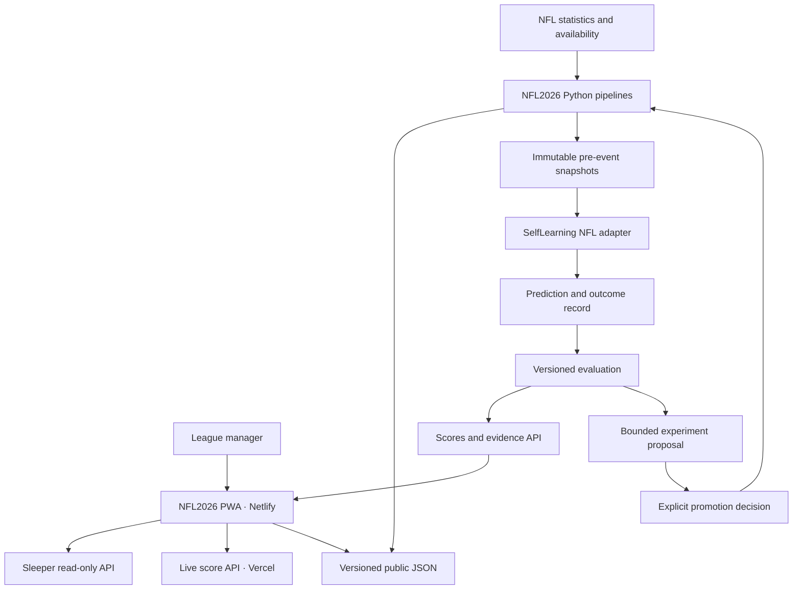
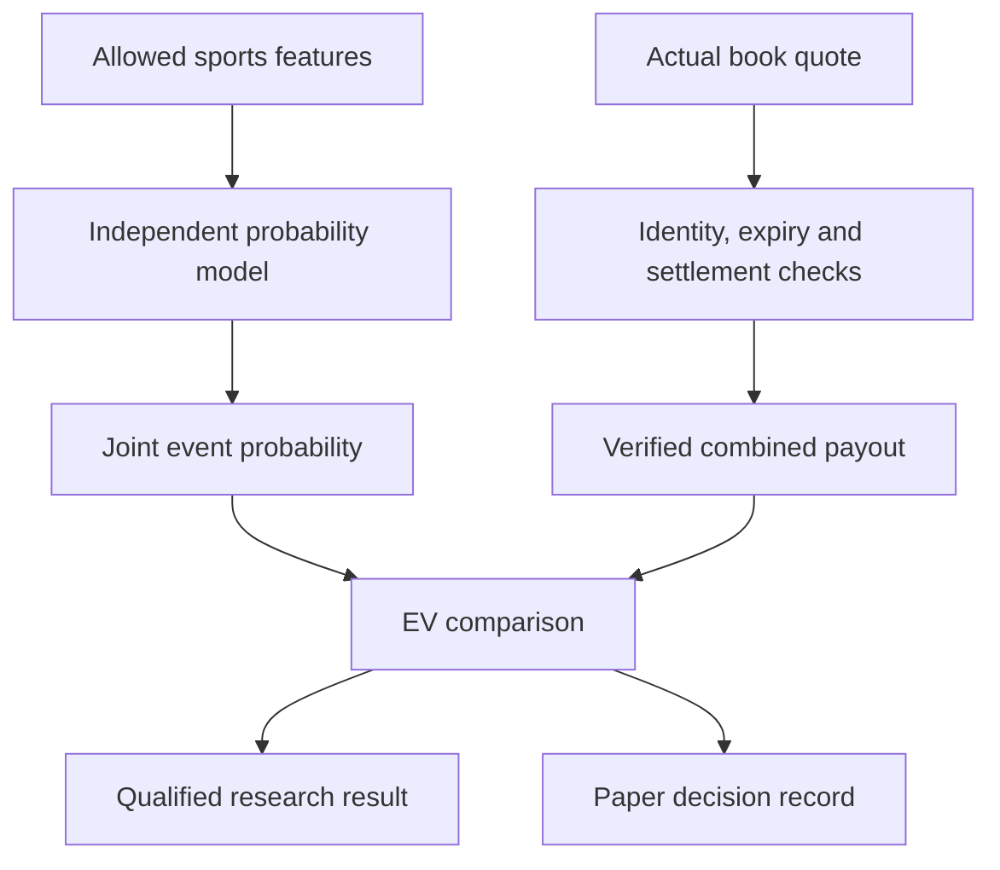

# Solution architecture

## Product goal and scope

NFL2026 should answer: What should I do with my Sleeper roster this week, what evidence supports that decision, and how reliable is it? Parlays are a separate independent research surface. SelfLearning records the evidence needed to improve models across projects without mixing their targets or granting a model control over production.

This is a personal product with a path to several leagues and projects. Do not introduce an enterprise event bus, microservice fleet, vector database or frontend rewrite before a measured requirement calls for one. Start with deterministic batch jobs, a small API boundary and an append-only record.

## Current state versus target

| Boundary | Current verified state | Target |
| --- | --- | --- |
| Frontend | Vanilla ES modules, hash router, eight primary tabs, browser-local league state | Same runtime; five destinations; typed JSON contracts and isolated view modules |
| Sleeper | Manual read-only league/roster import; coverage and scoring gaps | Identity-preserving sync, complete/partial scoring status, cached player directory, explicit team selection |
| NFL data | GitHub Actions write JSON under `data/` | Coherent immutable generations with a manifest, input provenance, quarantined failures and retained snapshots |
| Live scores | Runtime API hook and documented Vercel plan; consumer not found | `/api/nfl` in the existing Vercel `live-api` project, normalized status, bounded foreground polling |
| Parlays | Model legs plus synthetic/multiplied price assumptions | Independent joint model and separately verified combined quote, settlement-aware paper record |
| Learning | NFL ledger plus a separate SelfLearning foundation | Read-only NFL adapter, task-specific scoring, model-version attribution and explicit promotion |
| Shared state | SQLite implementation; Postgres schema; no verified hosted sports store | Supabase Postgres recommendation, private schemas, narrow read APIs and explicit ownership |
| Automation | Data and backtest workflows | Deterministic jobs plus bounded agents that prepare evidence and proposals |

## Component relationships

The arrows above describe dependencies, not a single synchronous request. The app must remain usable when evaluation or an LLM provider is unavailable. Public forecast reads are CDN-served; model fitting stays off the request path.

## Responsibility and source of truth

| Component | Owns | Does not own |
| --- | --- | --- |
| NFL2026 | NFL identity adapter, scoring rules, projection producers, UI, public JSON publication | Cross-domain evaluation policy implementation after parity is established |
| SelfLearning | Forecast/outcome contracts, immutable records, task scorers, model registry, evaluation runs, proposals | Sleeper business rules, live score display, trade execution |
| Existing Vercel live-api | Normalized live score reads; later small authenticated learning read/control endpoints | Long-running training, durable job state in process memory |
| Supabase Postgres, proposed | Shared durable forecast/outcome/evaluation and user-owned state | Public client write access to model decisions |
| GitHub | Source, CI, reviewable changes and initial batch scheduling | Guaranteed low-latency live score delivery |
| Manager | Own roster selection, final Sleeper actions, model promotion approval | Manual copying of routine feed data |

Sleeper is the source of truth for league configuration, roster ownership and lineup state. The app only reads its public API; setting a lineup or placing a waiver still happens in Sleeper. Its [official API documentation](https://docs.sleeper.com/) confirms the read-only boundary. Store the original IDs even when the model cannot project a player.

The final-result resolver is the source of truth for eligibility, subject to explicit revision. A live scoreboard is not an outcome writer. Forecasts are immutable observations of what was known and produced at the recorded time, not values reconstructed after results arrive.

## Keep the independent model and market comparison separate

There is no path from quote data, ADP, auction price or prediction-market price into model features, projection sort order or joint probability. Keep the existing opponent-model exception narrowly scoped to modeling draft-room behavior. A user's explicit EV sort on the Research page is a post-prediction comparison, not a player ranking or model feature; it should be separately authorized and named if added.

Use a feature allowlist and module dependency tests, not only banned string names. Store quote data in a separate contract and namespace. A season-series or futures market never substitutes for a single-game quote.

## Data and deployment lanes

**Immediate lane:** retain current JSON contracts and browser-local preferences. Fix the current defects without introducing a hosted-store dependency. Add `generation_id`, `schema_version`, `generated_at`, `source_max_as_of`, `model_version` and scoring coverage metadata as additive fields. Keep old routes resolving.

**Shared record lane:** an NFL import job reads committed immutable artifacts and writes a proposed hosted store idempotently. During shadow operation, NFL's current scorer remains the incumbent. Compare both scores on the same forecast IDs, outcome revisions, scoring policy and horizon. Switch a reader only after parity is documented.

**Later service lane:** private league preferences and paper ledgers can move from browser-local storage into authenticated storage. Published aggregate model metrics may be a separate public, sanitized read model. Never place private account records in Netlify's public `data/` directory.

## Proposed service levels

These are implementation targets, not measured current performance or provider guarantees.

| Capability | Initial target | Failure behavior |
| --- | --- | --- |
| Core page loading | p75 LCP <=2.5s on an agreed reference phone/network; no layout shift over 0.1 | Keep a lean shell and explicit loading state |
| Manual Sleeper sync | UI responds immediately; request deadline and retry affordance; last good state retained | Identify unavailable step; do not replace a valid roster with empty data |
| Foreground score polling | 15-30s requested cadence during active games, subject to source limits | Exponential backoff, pause in background, stale timestamp |
| Forecast refresh | Check generation on explicit refresh and foreground return; no mixed generations | Retain old complete generation with visible age |
| Resolution | Next successful resolver run after authoritative final stats | Pending remains pending; no clock-only conversion to final |
| Evaluation | Reproducible run with cohort counts, revisions and code/model hashes | Failed/ineligible run is visible and cannot promote |

GitHub documents that scheduled jobs can be delayed, and under sufficient load some jobs can be dropped. Use Actions for batch refresh/evaluation, not a live-score SLA. [GitHub schedule behavior](https://docs.github.com/en/actions/reference/workflows-and-actions/events-that-trigger-workflows#schedule)

## Access and operational decisions

The current browser password screen is a deterrent, not server authorization. Real private data requires Supabase Auth or a verified server session and ownership checks. Preserve the existing preference for username/password with a server-managed synthetic-email mapping; do not use client-editable metadata for authorization or assume that a shared league ID proves ownership.

Recommend hosted Supabase Postgres only when the read-only adapter and local schema tests are ready. Use a separate development project before any production migration; the repository forbids writing to the deploy-preview database. No hosted project, billing plan, credentials or migration is provisioned by this blueprint.

The core architecture can be approved without deciding autonomous financial execution. The financial execution packages in SelfLearning keep their existing separate policy and deployment boundaries. Shared evaluation code does not authorize betting or brokerage actions.
