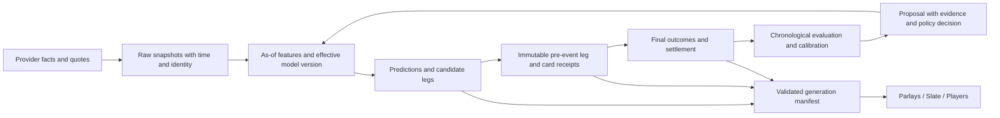

# NFL2026 — R82 root-cause analysis and code review for Claude

Date: 2026-09-17. Repository: `liddar12/NFL2026`.
Baseline: [`886b5bb40e68e90f6074489723fbe4c3703c0935`](https://github.com/liddar12/NFL2026/tree/886b5bb40e68e90f6074489723fbe4c3703c0935), main, “R82: MY PARLAYS cards — the bet you could not read, and rows that line up (#89).” The owner explicitly selected main/R82 as the review baseline.

## Decision for Claude

Keep the vanilla-JS PWA, static hosting, Python pipeline, existing measured baselines, and strong regression suite. Prioritize **Parlays → Slate → Players**, with the shared prediction/price/lock contracts fixed before expanding automation or adding model complexity.

The main concern is semantic correctness: readable cards can still show the wrong correlation, an assumed price as a book price, or historical probabilities that differ from the predictions graded. Several tests guarantee agreement between implementations without establishing that the shared rule is valid.

This is a review and handoff, **not an implementation or deployment**. Only review documents, offline diagnostic probes, screenshots, and logs were added locally. No app/model/workflow files were changed, no production data was regenerated, and nothing was pushed or sent to Claude externally.

## Scope and evidence

Deep review covered `app/views/{parlays,myparlays,slate,players}.js`; shared routing, data loading, rendering, review decoration and CSS; parlay generation/math/pool/archive/ledger/resolution; prediction construction, Elo, refitting, player fitting, promotion, replay and narrative paths; schemas, committed artifacts, all four Actions workflows, hosting/cache configuration, and relevant regression tests. Other feature surfaces were exercised by the repository-wide tests, not exhaustively reviewed line by line. This is not a production infrastructure, penetration, real-device Safari, or every-feed integration audit.

The requested `docs/RCA_MYPARLAYS_CARDS.md` was absent from this commit and returned 404 through GitHub. The reconstructed R82 RCA below uses `docs/ROADMAP_2026-27.md:217`, the current implementation, and `tests/web/r82_myparlays_layout.spec.mjs`. Historical before-fix geometry is attributed to those records, not to a before-fix browser run in this audit.

Evidence bundle: [files and reproducible probes](../reviews/2026-09-17/README.md). Source references below are repo-relative paths and line numbers at the pinned commit; new work must recheck them if main advances.

| Verification | Observed result |
| --- | --- |
| Data contract validation and smoke tests | Passed |
| Node feature tests | **1,685 passed, 0 failed** |
| Weekly, parlay, K/DST, leg-pool model gates | All four passed |
| Playwright web, PWA-emulation, performance suite | **279 passed**, approximately 3.1 minutes |
| Additional read-only JS/Python review probes | Passed their assertions that the documented defects reproduce |
| Visual review | Chromium, mobile 402×874 and desktop 1280×900; screenshots in bundle |
| Navigation failure injection | Delaying optional market data left `#/players` displaying “Loading slate…” |

Local environment was Node 26.7.0, Python 3.12.9, Playwright 1.61.1, and installed Chromium revision 1223. CI targets Node 22/Python 3.11; rerun there before merging fixes. Apple's default `python3` initially failed on an unaccepted Xcode license. The alternate Python passed steps 1–7; that run's browser step failed on sandbox port binding. After explicitly authorized localhost/browser access and selecting installed Chromium, the separate browser run passed. The saved `gate.log` therefore ends FAIL for that environmental browser startup, while `browser-tests.log` records the successful rerun. Do not describe the first gate log as green or either startup failure as an app defect.

## Reconstructed RCA: MY PARLAYS cards

**Symptom:** names clipped or stacked into many short lines, neighboring cards ended at different heights, EV wrapped, and MY showed the curated slate's heading/review summary.

**Immediate causes, as documented in R82:**

1. MY rendered `.leg` without `.leg--annot`. Its 100%-basis explanation competed with the name on one flex line. The historical measurement was 62 px available for a 155 px name at 1280 px, and 54 px on mobile.
2. Shared `.card-list` aligned items at the start; cards with different numbers of legs did not stretch to a common row height.
3. The 300 px grid minimum admitted columns too narrow for the footer; the EV label doubled its height.
4. MY hid the list but initially retained sibling chrome for the curated slate. Lazy review rendering could recreate the previously hidden banner.

**R82 repairs present and regression-tested:** annotation wrapping, wrapping MY leg names, scoped 360 px grid columns, stretched cards and anchored footers, nowrap EV, pool-week subtitle, and hiding/restoring the review strip including its delayed render. All R82 browser tests passed in this audit. See `app/views/myparlays.js:235`, `app/views/parlays.js:517,685`, `app/theme.css:865`, and `tests/web/r82_myparlays_layout.spec.mjs`.

**Systemic cause:** duplicated card construction plus implicit CSS/state contracts. Adding a class is functionally necessary but not expressed in the leg-rendering API. Repeated incremental additions also put more explanation and controls ahead of the actual decision. R82 repairs geometry; it does not establish probability, pricing, freshness, or historical-truth contracts.

**Prevention:** share a leg presenter that explicitly accepts annotation, availability, quote provenance and outcome; keep layout tests for real long labels, Q/NO EDGE badges, 2–6 legs, late review arrival, 320–1600 px, text zoom and WebKit. Add behavioral invariants for the data that the card claims, not only CSS-text assertions.

## Findings, ordered for implementation

P1 = correctness, historical measurement or availability defect to address before expanding the affected feature. P2 = important UX, resilience or explanation defect. No production incident or actual monetary loss is asserted. “Risk” describes the consequence of leaving the issue; LOE is an initial estimate in focused engineer-days including targeted tests, not a commitment or a simple additive schedule.

### F01 · P1 · Game legs lose side identity before MY correlation

**Evidence:** `scripts/models/parlay_builder.py:258` strips `_side`; `scripts/build_leg_pool.py:171` recovers team/game but does not restore `side`; `app/parlay-math.js:193` reads `leg.side || null`. All 29 game legs in the committed pool have no side in the client. For **BUF ML + J. Goff 125+ pass yds**, the current rho is **+0.10** instead of the existing rule's **−0.10**, and joint probability is **54.6134% instead of 50.8629%**. This is a comparison within the current model, not a claim that either number is calibrated truth.

**Cause/risk:** serialization drops a field the downstream math needs; opposing-side props can receive a positive same-side adjustment.

**Fix:** preserve canonical event/team/side fields across leg contracts, or reconstruct side from a validated schedule join; reject unresolved identity for correlation-sensitive builds. Require side for copied game legs in the schema.

**Acceptance:** production-shaped legs retain side through Python → JSON → JS; home/away favorite and opposing-prop fixtures produce identical signed rho in both languages. **LOE: 0.5–1 day.**

### F02 · P1 · Mixed-game MY cards drop within-game correlation

**Evidence:** `app/views/myparlays.js:128–136` sets correlated=true only if **every** leg has the same game. `buildCards()` permits multiple legs from one game plus legs from others. A committed-pool Aaron Jones Sr. five-leg example is priced at **45.0311%**; grouping its LAR legs together with the existing pair math gives **45.4437%**. The six-leg examples also differ; see probe output for exact legs.

**Cause/risk:** a card-wide boolean stands in for an event relationship. Adding an unrelated game switches off dependence between existing legs, distorting probability, ranking and EV.

**Fix:** partition legs by game, estimate each game's joint distribution, then combine independent game groups. Same-event exclusivity and participant checks belong inside each group.

**Acceptance:** same-game pair plus an independent leg equals joint(pair) × P(other); ordering and grouping do not change the result. **LOE: 1–2 days**, dependent on F03.

### F03 · P1 · The joint-probability approximation is order-dependent and violates a lower bound

**Evidence:** `app/parlay-math.js:106–133`, mirrored by `scripts/models/parlay_builder.py:329–375`. Permuting three legs with probabilities .8/.6/.7 gives **.372630, .373827, .371191** under the default table. `combineTwo(.9,.9,-.95)` returns **.7245**, below the required two-event lower bound **max(0,.9+.9−1)=.8**. The extreme negative-correlation example tests domain validity; it is not claimed to occur in the shipped slate.

**Cause/risk:** the correlation between adjacent individual legs is used as if it were the correlation between the entire accumulated event and the next leg. Beam search explores permutations and can prefer a different probability for the same unordered bet. Python/JS parity preserves this shared defect.

**Fix:** immediately enforce feasible bounds and a documented, validated supported joint model. A conservative interim option is at most two same-event legs until a permutation-invariant multi-leg model is validated; canonical sorting alone hides rather than fixes the mathematical problem. Evaluate selected-card calibration, not only single-leg calibration.

**Acceptance:** permutation invariance; Fréchet bounds; exact independence; mutually exclusive events zero; monotonicity when adding legs; same model/version in Python and JS. **LOE: 2–5 days** for containment and validation; a richer joint model is a separate research effort.

### F04 · P1 · Fair probabilities and independent products are presented as sportsbook prices

**Evidence:** `scripts/scrape/odds_api.py:99–150` takes the first available market and stores de-vigged probabilities without preserving raw odds/book/quote time. `scripts/models/parlay_builder.py:343–405` and `app/parlay-math.js:119` always multiply leg implied probabilities, even for same-game cards, and describe this as how books price them. The UI calls resulting EV “vs the book's parlay price.” There is no exact-card sportsbook quote in that path.

**Risk:** optimistic or simply non-executable EV/payout. For illustration, two −110 independent legs pay $264.46 net on $100; de-vigging each to 50% and multiplying implies $300 net. A fixed extra 2% per leg does not restore the original quotes. Same-game books additionally provide combination-specific odds: [DraftKings' own SGP interface](https://sportsbook.draftkings.com/same-game-parlay) advertises dynamic combined odds, and its [help page](https://help.draftkings.com/hc/en-us/articles/18517837742867-What-is-a-Same-Game-Parlay-SGP-bet-US) requires selections to obtain them.

**Fix:** separate `model_probability`, `market_fair_probability`, raw executable decimal odds, and exact-card quote. Preserve bookmaker, timestamp, market/selection/line and availability. Show **quote unavailable** for actionable EV when an exact supported quote is absent; hypothetical comparisons must say so on the card. Keep all market prices out of model inputs.

**Acceptance:** round-trip known American odds; unknown quote → null actionable EV/payout; source/time shown; same-game pricing uses an actual combination quote or clearly named simulation. **LOE: 2–4 days** for contract/UI honesty; sportsbook feed integration is separate and provider-dependent.

### F05 · P1 · A synthetic game price is marked as a real book price

**Evidence:** `scripts/models/parlay_builder.py:228–253` creates `implied_prob=model_prob×1.045` when no feed exists. The serialized leg has no quote provenance. `scripts/build_leg_pool.py:199` labels the copy “as-made book price,” and `app/parlay-math.js:193–204` sets `priced:true` merely because `implied_prob` is numeric. Probe: an unquoted 60% moneyline produces .627 and is classified as real. `whyLine()` then says “book price.” This is a confirmed fallback-path defect, not proof that the current 29 game legs were fetched without a key.

**Fix:** explicit provenance enum such as `book_quote | fair_market | assumed | unavailable`; never infer it from number presence. Carry it from ingestion through archives, pools, reviews and rendering.

**Acceptance:** key absent, feed outage and incomplete markets remain visibly assumed/unavailable; genuine quotes retain source/time. **LOE: 1–2 days**, shared with F04.

### F06 · P1 · MY and curated cards use different payout assumptions; “PAYS” is net profit

**Evidence:** MY uses `100×(1/product(implied_prob)−1)` at `app/views/myparlays.js:137–147`. Review uses flat **−110** for every prop at `scripts/build_review.py:722–778`. The same two synthetic .8-probability props (.836 implied each) produce **$43.08 net in MY** versus **$264.46 net in review**. Both card paths say `$100 PAYS`; the displayed number excludes returned stake, while the legend calls it what a wager returns. Graded review cards say RETURNED even though their value is net P&L.

**Risk:** users cannot compare cards or interpret money consistently. Hypothetical graded returns may read as a realized betting record despite absent actual wagers/quotes.

**Fix:** use the F04 quote contract and one settlement implementation. Distinguish stake, gross return and net profit. Label simulated backtest P&L with its exact price assumptions and distinguish it from recorded placed wagers.

**Acceptance:** identical leg/quote snapshots produce identical money across MY, GAME/WEEK, history and replay; $100 at decimal 2.0 means $200 gross/$100 net; unknown price stays unknown. **LOE: 1–2 days** after the quote contract.

### F07 · P1 · MY offers no current kickoff/status eligibility check

**Evidence:** `data/contracts/leg_pool.schema.json` supplies game IDs but no kickoff or event status per usable leg; `poolLegs()` and `buildCards()` have no clock/status filter. The player availability gate excludes non-playing players, but it is not a kickoff gate. `current_week()` can retain a partly completed week, so its pool can include Thursday legs on Sunday. Neither MY nor curated upcoming cards provide an explicit pregame/in-play/closed selection policy.

**Risk:** stale pregame probabilities can be offered as current selectable bets after an event begins or finishes. The user sees a week, not the age/eligibility of each leg.

**Fix:** publish kickoff/status and source timestamps; distinguish **Upcoming** from historical/review mode; prevent new pregame selection at cutoff, retaining existing saved cards as immutable history. Recheck when a suspended PWA resumes.

**Acceptance:** Thursday kickoff/final during an open Sunday week; postponed/rescheduled event; device resume after kickoff; stale pool; archived cards remain readable. **LOE: 1–2 days.**

### F08 · P1 · Opening game locks lack the timestamp guard used by the other ledgers

**Evidence:** `scripts/build_predictions.py:863–876` writes all week games as `estimate=False` if the weekly file is absent, without comparing kickoff and lock time. `scripts/harness/snapshot.py:50` accepts that row; `scripts/resolve_locks.py:56` scores it without checking cutoff. A synthetic post-event lock is accepted and gets log-loss .22314355 in the Python probe. **None of the 32 committed opening-lock rows were late in this audit**; the latent defect is reproducible, not an allegation of existing fabricated measurements.

**Risk:** an initial/delayed run after Thursday kickoff, a missing archive, or a rebuild can contaminate the supposedly pre-event learning set.

**Fix:** enforce `as_of <= locked < kickoff` with timezone-aware datetimes and event status at the write boundary and again at resolution. Keep post-event rows only as explicitly unscorable observations. Support adding still-future missing event locks without rewriting old locks; file existence is not an event-level lock policy.

**Acceptance:** exact kickoff boundary, timezone forms, delayed first run, missing Thursday lock, later Sunday lock, immutable earlier records. **LOE: 1–2 days.**

### F09 · P1 · Game refitting uses interleaved cross-validation instead of walk-forward evaluation

**Evidence:** `scripts/refit.py:224` assigns strided folds; `cross_validated_refit():331` trains on every other fold. With ordered rows 0…9, fold `[0,5]` trains on `[1,2,3,4,6,7,8,9]`, including later events. Its comment says global scalars make this leak-free, but it does not reproduce what could have been fitted as of an earlier kickoff.

**Risk:** the claimed leak-safe adoption metric includes future outcomes relative to the scored prediction period. This is distinct from training on the test row itself. [The TimeSeriesSplit documentation](https://scikit-learn.org/stable/modules/generated/sklearn.model_selection.TimeSeriesSplit.html) describes this temporal-validation concern; no dependency on scikit-learn is proposed.

**Fix:** chronological, event/week-grouped expanding folds, an explicit fit cutoff, final untouched evaluation period, and incumbent/candidate evaluation on identical eligible events. Require an adequate amount of history; “two rows” is not a useful deployment standard.

**Acceptance:** latest training kickoff precedes every held-out kickoff; future outcome mutations cannot change earlier fitted predictions; all snapshots of one event stay together. **LOE: 2–3 days.**

### F10 · P1 · Evaluation and production do not execute the same game model

**Evidence:** `data/model_tuning.json.game_params.k` is **25**, but `scripts/build_predictions.py:609,618` omits `k`, using `scripts/models/elo.py:21`'s default **20**. The live refit scorer at `scripts/refit.py:245` evaluates reverted fixed prior ratings; `_enrich_with_raw_elo():486` derives those with default prior-season parameters. Production recomputes priors under adopted HFA, chains current-season results, and applies promoted signal deltas. Thus a candidate clears a different computation from the one shipped.

**Risk:** improvements measured by a gate may not survive application; the displayed adopted parameter set is not the complete effective model.

**Fix:** one pure as-of replay engine, one versioned complete parameter object, explicit effective inputs and time cutoffs. Use it for historical replay, candidate evaluation and production. Apply `k` deliberately in all relevant chains.

**Acceptance:** replay of a stored pre-event input snapshot equals the production probability for that version; changing adopted `k` changes production; each active signal is exercised in both paths. **LOE: 3–5 days**, the main prerequisite for stronger learning claims.

### F11 · P1 · Successful gameday refit replaces the entire game parameter object

**Evidence:** `scripts/refit.py:613` assigns a new `doc['game_params']` with only HFA, revert, time and source. The current object also has `k` and an applied `qb_out` configuration. A successful adoption silently drops those and any other promoted families.

**Risk:** fitting two parameters can turn off independently adopted behavior. This adoption branch was not executed against live state in the audit.

**Fix:** construct an explicit candidate model version preserving unrelated parameters, and evaluate that exact full object before committing it. A shallow merge is the immediate field-preservation fix; it does not by itself address F10.

**Acceptance:** seeded `k`, `qb_out`, and another nested family survive HFA/revert adoption byte-for-byte; refusal leaves everything unchanged; version and effective-param receipt match. **LOE: 0.5–1 day**, coupled to F10.

### F12 · P1 · Weekly parlay archives are mutable until the last game ends

**Evidence:** `scripts/build_parlay_archive.py:105–140` replaces an open week's complete `parlays` on changed content, saving timestamp history rather than full old compositions. It freezes only when all games are FINAL. Meanwhile same-game IDs use rank (`game-g1`) and weekly IDs use leg-count/rank, so an ID may refer to a different bet after a rebuild. `app/review.js:410–452` joins review by parlay ID and stamps leg outcomes by array index.

**Risk:** a Thursday card can change after Thursday's result while the week remains open; history/replay may evaluate the last composition rather than the originally offered combination. Mixed-version cached review/card files can stamp an outcome on the wrong leg. A pre-kickoff **leg** ledger does not prove that a particular **combination** was offered before kickoff.

**Fix:** immutable card snapshots identified by canonical ordered leg IDs plus model/quote/input version; freeze a card before its earliest relevant kickoff. Store outcomes separately and join by immutable leg IDs. Keep the weekly index as a view over snapshots, not the historical source of truth.

**Acceptance:** rebuilding Friday cannot replace Thursday's published card; a rank change yields a new card ID; reordered legs retain correct outcomes; replay requires an eligible card receipt. **LOE: 2–4 days.**

### F13 · P1 · Historical Slate probabilities are recomputed, but its result badges grade old locks

**Evidence:** `scripts/build_predictions.py:773–832` predicts the full season from today's chained ratings; `app/views/slate.js:152–159` displays those values for previous weeks. `app/review.js:210` decorates them using locked picks and outcomes. Committed game **401872657** has locked home probability **62.67%** but displayed schedule probability **48.67%**—even the favorite flips. The review result remains tied to the original pick.

**Risk:** a past card's probability/winner emphasis and its won/lost receipt can describe different predictions. This undermines both user understanding and auditability.

**Fix:** show the actual locked forecast and final score on historical Slate; optionally expose “recomputed with current model” as a separate explicit analysis mode. Do not overwrite historical predictions with today's ratings.

**Acceptance:** all historical rendered probabilities equal their selected immutable lock; correct winner/result on flipped-favorite fixture; unavailable lock displays “no pregame forecast on file.” **LOE: 1–2 days** after lock identity is settled.

### F14 · P1 · In-memory caching defeats the documented freshness policy

**Evidence:** `app/data.js:59–84` retains fulfilled promises without TTL. The reviewed pages call getters without force; main paints health once; no app-wide resume refresh exists. HTTP cache headers cannot revalidate a request that is never issued. `tests/perf/budget.spec.mjs:468` explicitly rewards no repeated in-session fetch. `app/review.js:57` also keeps its own document promise.

**Risk:** a long-lived installed PWA can show old injuries, prices, pool and results after new data has shipped, with an old health badge.

**Fix:** retain in-flight deduplication but add bounded freshness, a generation manifest, foreground/resume checks, cancellable refresh and a visible “updated/as of” indicator. Refresh related contracts coherently and validate season/week/version compatibility. Apply age at read time, not only the pipeline's old `age_hours` field.

**Acceptance:** fake-clock TTL, visibility resume, offline last-good banner, updated pool and review after generation change, no duplicate concurrent fetch, no mixed-generation card grading. Revise the performance test to permit intentional refresh. **LOE: 2–3 days.**

### F15 · P1 · A pending optional request can block navigation to another page

**Evidence:** `app/views/slate.js:62` awaits optional market data before painting; Players awaits eleven results at `app/views/players.js:821`; the shared fetch has no timeout. `app/main.js:199` serializes mounts. Browser reproduction: delay only `/data/market_prices.json`, navigate to Players, wait 600 ms; hash is `#/players` but content stays **“Loading slate…”**. The next route cannot run until the old mount resolves.

**Risk:** bad connectivity or a stalled optional feed traps users across all routes, despite allSettled/catch handlers. Those handle rejection, not a never-settling promise.

**Fix:** per-route abort/lifecycle ownership, bounded fetch deadlines, detached mount or cancellation-safe painting, and progressive optional enrichments after required content. Avoid keeping obsolete route work in a queue that prevents the next route.

**Acceptance:** never-resolving market/history/review requests do not block required page content or navigation; late responses cannot paint stale routes; retry is visible and functional. **LOE: 1–2 days.**

### F16 · P1 · The “race-safe” Git push loop cannot recover from divergence

**Evidence:** `.github/workflows/daily.yml:213`, gameday's final commit step, and backtest's final commit step commit locally then retry `git pull --ff-only && git push`. Once another writer adds a commit from the common base, both sides have commits and a fast-forward pull cannot merge them. Repeating it cannot change that. Daily/backtest share `data-pipeline`; gameday uses `gameday`, so those writers are not serialized together.

**Risk:** successful data generation fails to publish during simultaneous runs or owner code pushes. No current production push failure is asserted; the algorithm is structurally unable to resolve that case.

**Fix:** one publisher/concurrency strategy; produce isolated staged artifacts, refresh the target head, reconcile immutable records by identity and rebuild dependent outputs, validate, then commit/push. Retry by recreating the publish commit on the new head, never by force-pushing or blindly preferring generated files over other locks/history.

**Acceptance:** two runs and a code push race in a temporary repository; no lost locks/model history, newest valid generation published, bounded retries and explicit failure. **LOE: 1–2 days.**

### F17 · P1 · Gameday and daily workflows publish different dependency graphs

**Evidence:** gameday runs `build_predictions` and parlay archive/review but does not rebuild `leg_pool`, append/resolve parlay legs or append/resolve player estimates. Daily does. Gameday's score step invokes absent `scripts.scrape.espn_scores_cli` under `|| true`; in scores-only mode it also skips `build_predictions`. `pipeline_status.json` is produced inside prediction building before many later ledger/review steps, so it does not describe those later failures.

**Risk:** GAME can reflect new inactives and prices while MY still uses an older pool; newest offered legs may never get a pre-kickoff receipt; a score refresh step can report success without executing its stated CLI. This is code-path evidence, not an audit of external Claude Routine scheduling.

**Fix:** define a single task dependency graph with daily/gameday mode inputs; rebuild all downstream affected artifacts under one generation. Replace the placeholder with the actual score reader or remove it with accurate mode semantics. Publish stage statuses, last-success, skipped reasons and watermarks for each ledger/review/pool step.

**Acceptance:** injury/price update changes GAME and MY together; every offered eligible leg/card has a lock; scores-only updates final results or reports an explicit failure; resolver outage is visible in final health. **LOE: 2–3 days**, shared with F14/F16.

### F18 · P2 · Parlay controls and glossary hide the first useful card on mobile

**Evidence:** 402×874 browser measurement: first curated parlay top **1,217 px**, glossary height **465 px**. The initial viewport shows no bet. See [Parlays screenshot](../reviews/2026-09-17/parlays-mobile.png). `app/views/parlays.js:290,657` paints the long always-open legend before cards, alongside separate week, scope, leg-count, tier, sort, outcome and P&L surfaces.

**Fix:** first-screen hierarchy: compact week/freshness → Build/Published/History mode → primary search or a useful card. Consolidate filters into an expandable panel with active-count summary; collapse glossary into “How these numbers work,” as Players already does. Keep price provenance/availability next to the relevant number, not buried in the glossary. Hide empty postgame controls in an entirely upcoming week.

**Acceptance:** at 402×874 a meaningful card/selection result starts above the bottom navigation; filters remain discoverable; screen reader labels and 44 px touch targets remain; history state remains obvious. **LOE: 1–2 days.**

### F19 · P2 · MY rejects the example it asks users to type

**Evidence:** `app/views/myparlays.js:325–346`: exact full-name lookup, placeholder **“J. Jefferson, KC”**, silent clear on invalid entry. Committed options contain **Justin Jefferson**, not J. Jefferson. Entering the placeholder's example produced zero cards and no explanation; full name works. Abbreviated card labels are not accepted as search aliases either.

**Fix:** identity-backed autocomplete with full/abbreviated/last-name/team aliases and position/team disambiguation. Display unsupported players with a reason (no calibrated market, injury, no projection, excluded position), preserve invalid text, and offer an explicit add action. State **any selected seed** vs **all selected seeds**; current code intentionally means any, not all.

**Acceptance:** J. Jefferson, Justin Jefferson, Jefferson and KC; duplicate surnames; unavailable TE; invalid text; keyboard and touch selection; multiple-seed semantics explicit. **LOE: 1–2 days.**

### F20 · P2 · Review expansion is mouse/touch-only; tabs lack their keyboard interaction

**Evidence:** `app/review.js:229–242` sets aria-expanded on an article and installs only a click listener; the card has no native button or keyboard action. Slate and Parlay week/scope controls declare tabs but supply neither tabpanel association nor roving focus/arrow handling. HTML buttons remain individually tabbable, so the issue is incomplete widget semantics, not complete keyboard inaccessibility of those controls.

**Fix:** a real “Why this result” button with aria-controls, Enter/Space behavior and visible focus; either implement the [WAI tabs pattern](https://www.w3.org/WAI/ARIA/apg/patterns/tabs/) or use ordinary grouped filter buttons with aria-pressed. Give repeated WEEKS actions player-specific accessible names.

**Acceptance:** keyboard-only route/week/result flow, focus after close/repaint, axe plus manual screen reader checks, 200% text zoom and WebKit/iOS validation. **LOE: 1–2 days.**

### F21 · P2 · Narrative validation does not establish that the text is supported

**Evidence:** `scripts/build_review_narrative.py:112` checks word count and numeric tokens. Given only `{"delta":-10.7}`, both **“The player missed because he was suspended.”** and **“He exceeded his projection by 10.7 points.”** are accepted. Signs, entities, causal assertions and direction are not validated. The layer is optional; this finding does not establish it is enabled in production.

**Fix:** deterministic narration for core result claims, or structured claims referring to approved fact IDs, followed by entity/value/unit/sign validation. Retain why_hash binding and the measured explanation; add prompt version, model version, refusal counts and cost/run receipts for the optional LLM layer. Treat model output as a proposed explanation, not a verified causal conclusion.

**Acceptance:** fabricated injury/suspension, sign reversal, swapped player, new cause, unit change and stale attribution are rejected; safe paraphrase works. **LOE: 1–2 days.**

### F22 · P2 · “Confidence tier” is an edge heuristic, not calibrated uncertainty

**Evidence:** `app/parlay-math.js:156` and `scripts/models/parlay_builder.py:378`: tier is model probability minus implied probability minus a leg-count penalty. With the same .6 model probability and three legs, changing only implied price .3/.47/.55 changes HIGH/MEDIUM/LOW. The model doc calls this “conformal-flavored”; no conformal coverage calculation is involved here.

**Risk:** a confidence label can be read as likelihood or reliability, and moves when the bookmaker price moves even though the forecast is unchanged. MY screenshots show high hit probability next to LOW, without clarifying the difference.

**Fix:** rename the present heuristic to an explicitly estimated **edge category** and suppress it for missing quotes; show hit probability separately. If calibrated uncertainty is desired, validate a true interval/set or reliability measure on eligible held-out data, with sample size and coverage stated. Do not equate fitted single-leg reliability with combination reliability.

**Acceptance:** quote changes do not alter model confidence; edge and hit probability are separate; no conformal claim without coverage evidence. **LOE: 0.5–1 day** for honest labeling, **3–5 additional days** for an uncertainty evaluation prototype.

### F23 · P2 · Failure of curated parlays prevents access to an otherwise independent MY pool

**Evidence:** `app/views/parlays.js:398–410` returns before creating the scope controls if `parlays.json` fails or has no rows. MY loads its own pool only after those controls exist. Separately, pool loading failure returns null inside `mountMyParlays`; the caller's `myMounted` stays true, so switching away and back does not retry. Errors have no explicit retry button.

**Risk:** a usable feature is hidden by an unrelated feed failure; recovery requires a whole-page reload.

**Fix:** mount the shell/mode controls independently; isolate Published, History and MY loading states; give each failed dependency a bounded retry and clear stale-state message. Consider hash/query-addressable mode, week, seeds and filters rather than relying entirely on hidden module state.

**Acceptance:** missing/empty curated feed with valid pool still permits MY; failed pool then restored feed succeeds on Retry; reload/deep link restores chosen mode. **LOE: 1–2 days.**

## Additional UX and maintainability improvements

These are enhancements or lower-impact issues, not all release-blocking defects.

| Surface | Recommendation | Risk / tradeoff | LOE |
| --- | --- | --- | --- |
| MY cards | Show matchup, kickoff, player position/team and explicit % beside hit probability; offer leg-count controls and explain seed inclusion | More information requires progressive disclosure; duplicate names otherwise lack context | 1–2 d |
| MY search | Move expensive build work into a worker only after measuring input-to-render latency; cancel superseded searches and diversify near-identical cards | Beam search is heuristic; don't claim exact global optimum or add worker complexity without measurement | 1–2 d prototype |
| MY history | Save/export a versioned card locally with immutable inputs and an explicit “saved simulation” status; later provide optional sync | Requires new persistence/product scope; no claim a saved card was actually wagered | 2–4 d local |
| Published parlays | Fix duplicated **BUF ML ML** (`app/render.js:129` appends ML to already suffixed selections) | Low-risk copy correction; lock formatting by canonical market fields | <0.5 d |
| Published parlays | Replace mandatory three-card/single-leg top-ups (`parlay_builder.py:822`) with honest available count | Changes a legacy schema/count expectation; single repeated legs should not be sold as diverse parlays | 0.5–1 d |
| Slate | Show scheduled/live/final state and score alongside the right forecast snapshot; next-kickoff shortcut and opponent/team filter | Current checkout has no `app/live-scores.js`/`app/live-poller.js` despite CLAUDE.md describing them; confirm external live API before promising real-time behavior | 1–3 d after data contract |
| Players | Add name/team search, persisted position filters, compare/add-to-parlay actions, and relevant unavailable-state explanations | A 300-player card list with only position/sort and SHOW MORE makes specific-player retrieval expensive | 1–2 d |
| Players | Rename BASE/AI+ to **Season / This week**; label shipped scenario override separately from time horizon | “AI+” currently changes the horizon and sorting, while BASE itself ships the owner-overridden scenario. Preserve scoring and numbers | 1–2 d |
| Players | Put horizon, scoring/league, availability, projection/band and deviation from the chosen baseline in a stable hierarchy; collapse auction/draft context outside draft tasks | Reduces first-screen clutter; existing card starts at ~645 px on 402×874 | 1–2 d |
| Shared UI | Extract shared pure leg/card presenters and a small route lifecycle contract, retaining ES modules/no bundler | Avoid a large generic design system rewrite; extraction must preserve accessibility and budgets | 2–3 d, incremental |
| Identity | Make `player_id` provider-neutral with explicit ESPN/nflverse/Sleeper IDs and match provenance | Current `gsis_id` often contains `espn-*`; migrating IDs without aliases could break local rosters and ledgers | 2–4 d design/migration |
| Operations | Pin dependency versions, use npm ci, document supported local Python/Node/browser; publish only required runtime artifacts | Publishing `.` includes source/docs/test assets; no secret exposure was demonstrated. CI's “no lockfile” comment is stale | 0.5–1 d |

Screenshots: [Published Parlays](../reviews/2026-09-17/parlays-mobile.png), [MY mobile](../reviews/2026-09-17/my-parlays-mobile.png), [MY desktop](../reviews/2026-09-17/my-parlays-desktop.png), [Players mobile](../reviews/2026-09-17/players-mobile.png). These are local renderings of the pinned code/data, not proof of the deployed site's exact state.

## Data and pipeline target

Keep the existing static product; improve its contracts and publication boundaries first.

Required envelope: `schema_version`, `generation_id`, `season`, `week`, `generated_at`, `source_as_of`, `input_hashes`, `model_version`, effective parameter hash, source/identity provenance, availability and quality state. Use event/participant/market/line IDs as keys; formatted selection text is presentation. Keep forecast, executable quote, assumed scenario and observed outcome as distinct types.

Build into a staging location; check cross-artifact invariants before a single publish operation. Preserve last-good artifacts with explicit stale state on optional failure. Store each source watermark and stage result, including resolvers, backtests, pool and review—not just feed HTTP success. Use one orchestrator entry point for daily/gameday variants so downstream dependencies cannot silently drift.

GitHub Actions schedule remains best-effort. Define observable freshness objectives, e.g. pregame availability updated within an agreed window, and alarm when missed. This review does not select a new scheduler or create infrastructure. If the owner's external routines provide dispatch, document and monitor their successful run receipts too.

## AI/self-learning: current reality and recommended next steps

The repository has substantial evaluation infrastructure: locked estimates, outcome resolution, calibration, walk-forward player fitting, game signal proposals, measured baselines, and a replay lab. It does **not** have a single uniform automatically promoting learner.

| Mechanism | Current behavior / limitation | Recommendation |
| --- | --- | --- |
| Game scalar refit | Gameday may auto-adopt HFA/revert; F08–F11 weaken the guarantee | Repair exact replay and temporal validation before expanding automatic adoption |
| Game signal families | Weekly `promote_signals --propose`; manual promotion is an explicit R26 owner decision | Preserve proposal-only behavior; improve evidence and decision receipts |
| Player signals | Weekly `fit_player_signals --propose`; no held-out fold with only one resolved week | Keep refusal honest; display evidence readiness, not “learning complete” |
| Shipped player projection | `SHIPPED_ESTIMATE='candidate'` by explicit 2026-09-02 owner override; gated comparator retained | Preserve override, label it visibly, and evaluate shipped/candidate/gated independently |
| Parlay live calibration | 37 resolved prop legs, one week; live refit arms at 100 | Count distinct events/player-weeks too; many correlated rungs are not independent evidence |
| MY pool | Separate historical wide-pool calibration, 220 eligible players/1,296 prop rungs/29 game legs at baseline | Add selected-card and live wide-pool evaluation; do not inherit curated-slate validation claims automatically |
| Replay Lab | Measure-only; re-prices/re-selects recorded legs; lacks full as-of universe to reconstruct alternative slates | Preserve limits; snapshot eligible/rejected candidate universe and input versions to enable honest selection replay |
| LLM narrative | Optional runner-only prose over measured attribution | Keep outside numeric prediction/promotion; strengthen factual checking (F21) |

Measured live player record is **one week/216 players**, shipped MAE **6.146** versus gated **6.377**, with **45.83% interval coverage**. Those are observations, not proof that the override generalizes. `model_tuning.json` explicitly says its retained `qb_out` effect was adopted under a retired rule and its 95% interval spans zero. Preserve that warning and re-evaluate; do not quietly treat a retained setting as newly validated.

Recommended learning sequence:

1. **Reproducibility:** fix F08–F13; freeze features, eligibility, forecast, quote and candidate selection before events. Include both accepted and rejected candidates to measure selection effects.
2. **Outcome quality:** FINAL-only scoring, explicit pushes/DNP/void/corrections, versioned outcomes, idempotent resolution and match-confidence auditing. Keep market-specific settlement rules separate from probability outcomes.
3. **Evaluation:** event-grouped chronological folds; identical incumbent/candidate cohorts; log-loss/Brier/reliability for probabilities, MAE/rank and interval coverage for player estimates; grouped uncertainty intervals; slice by market, position, probability band and leg count. Evaluate the actual selected portfolio and exposure as well as individual legs.
4. **Proposals:** record sample adequacy, input/model hashes, gains and uncertainty, failure slices, alternative trials and rollback version. Keep the documented never-regress margins; do not weaken a gate to achieve promotion.
5. **Release policy:** retain current owner-approved promotion boundaries. Shadow-mode candidates are the recommended next stage. Any broader automatic promotion is a separate product/policy decision after correctness work and adequate evidence.
6. **Runtime monitoring:** calibration drift, unmatched identity rates, missing/late locks, stale eligibility/quotes, sample support, interval coverage, pool exclusions, and generation mismatches. Distinguish “data arrived” from “model improved.”

A safe near-term improvement is an **evidence status panel**: current shipped model/version; owner override, if any; newest eligible outcome week; distinct sample size; active/neutral signals; last proposal and why accepted/refused; drift and freshness. It makes the existing learning behavior understandable without adding an LLM to the prediction path. **LOE: 2–3 days** once metadata is consistent.

## Implementation order and acceptance gate

| Phase | Scope | Estimated elapsed effort for one engineer | Exit criterion |
| --- | --- | --- | --- |
| 1 · Truthful Parlay cards | F01–F07, F22; contain unsupported joint/price claims | 5–8 d | Identity, probability, quote and money agree; no new pregame cards after cutoff |
| 2 · Learning receipts | F08–F13 | 6–10 d | Immutable event/card history; historical UI and exact replay use the same forecast; chronological gate |
| 3 · Reliable refresh | F14–F17, F23 | 4–6 d | Optional outages do not trap navigation; coherent generation refresh and race-safe publish |
| 4 · UX in requested order | F18–F20; Parlay, then Slate, then Players enhancements | 4–7 d | Useful mobile first screen, successful search, explicit horizons, keyboard and WebKit coverage |
| 5 · Learning expansion | Candidate-universe snapshots, evidence panel, shadow evaluation, F21 if enabled | 4–8 d initial instrumentation | Measurable, reproducible evidence; no unauthorized promotion change |

These phase ranges overlap shared work and should replace summing individual rows. External quote licensing/API access, real iOS verification, and statistically adequate future outcomes can extend elapsed time independently of coding effort.

For each fix, add targeted tests that currently fail, then run the full ordered gate and browser suite. Add explicit invariants that the present green suite lacks: executable-vs-assumed quote provenance, permutation invariance, event-grouped correlation, before-kickoff locks, full parameter preservation, as-of replay equality, immutable card IDs, stale-resume refresh, hung optional fetch, and source-to-render field preservation. Test actual iOS Safari/WebKit; Chromium mobile emulation and CDP standalone emulation are not equivalent to an installed iPhone PWA.

Do not fix F03 by deleting parity coverage, fix F14 by disabling performance budgets, or fix F16 by force-pushing. Update tests that currently enforce an incorrect contract and retain meaningful regression coverage.

## Preserved decisions and follow-up choices

No additional owner decision is needed to review or prepare this report. The recommendations above use mobile-first reading with desktop verification and preserve the existing architecture, QUESTIONABLE-player policy, price independence, player override and proposal-only signal policy.

If Claude is later authorized to implement, ask only a genuinely necessary product decision, one at a time, with a recommended option, risk and LOE. The first likely choice is quote behavior: **recommend model-only probability with “quote unavailable” until an executable quote exists** (risk: fewer flashy EV/$ figures; LOE 1–2 d within Phase 1), versus visibly labeled simulated prices (risk: still easy to mistake for a purchasable bet; LOE 1–2 d), versus a real sportsbook quote integration (risk: provider access/licensing and availability; LOE 3–7 d after access). Preparing this report does not authorize any of those implementations or a deployment.
